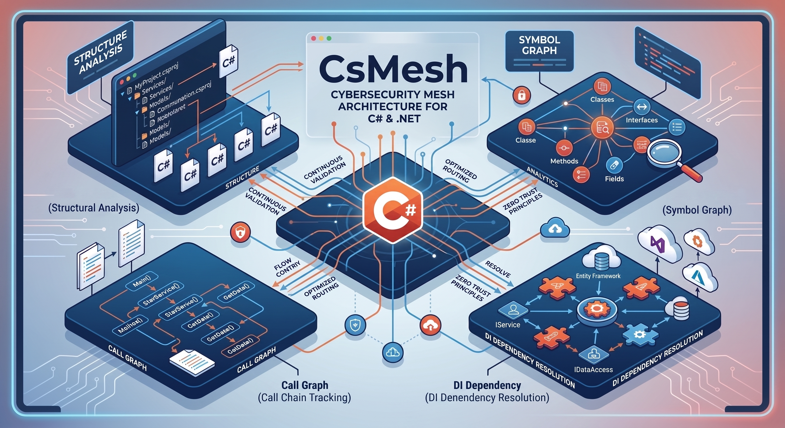

<div align="center">

# ⚡ csmesh

### Structural Code Intelligence Engine for C# & .NET

**Answers architectural, call-graph, and dependency questions under a hard token budget.**  
Built for AI coding agents and developers who are tired of multi-turn "file-hopping" and noisy grep queries.

[](https://dotnet.microsoft.com/)
[](https://learn.microsoft.com/en-us/dotnet/core/deploying/native-aot/)
[](https://github.com/nRafinia/CsMesh)
[](https://github.com/nRafinia/CsMesh)
[](LICENSE)

</div>




---

```bash
$ csmesh trace PaymentController.Post --budget 600

PaymentController.Post  {http:POST /charge}  Api/PaymentController.cs:14
  -> CreatePaymentCommandHandler.Handle  [mediatr via Send(CreatePaymentCommand)]  App/CreatePaymentCommand.cs:18
    -> IPaymentGateway.Authorize  Infra/Repositories.cs:11
      -> StripeGateway.Authorize  [impl, di-bound]  Infra/Repositories.cs:29
    -> IPaymentRepository.Add  Infra/Repositories.cs:7
      -> PaymentRepository.Add  [impl, di-bound]  Infra/Repositories.cs:17
        -> AppDbContext.SavePayment  Infra/Repositories.cs:34
      -> InMemoryPaymentRepository.Add  [impl]  Infra/Repositories.cs:23
```


---

## 📑 Table of Contents

- [The Problem: The Hidden Tax of AI Code Exploration](#-the-problem-the-hidden-tax-of-ai-code-exploration)
- [Why a CLI Beats an MCP Server](#-why-a-cli-beats-an-mcp-server)
- [Empirical Benchmarks](#-empirical-benchmarks)
- [Key Features](#-key-features)
- [Installation](#-installation)
  - [Global .NET Tool](#1-as-a-global-net-tool)
  - [Standalone Native AOT Binary](#2-as-a-standalone-native-aot-binary-zero-runtime-dependency)
- [Quick Start](#-quick-start)
- [Supported IDEs & AI Coding Agents](#-supported-ides--ai-coding-agents)
- [CLI Reference](#-cli-reference)
- [The Recommended Hybrid Workflow: csmesh vs. grep](#-the-recommended-hybrid-workflow-csmesh-vs-grep)
- [Deterministic Exit Codes](#-deterministic-exit-codes)
- [Telemetry & Audit Logging](#-telemetry--audit-logging)
- [Repository Structure](#-repository-structure)
- [License](#-license)

---

## 🛑 The Problem: The Hidden Tax of AI Code Exploration

When an AI coding agent or engineer asks a structural question about a decoupled C# codebase—such as:
* *"If I modify this interface method, what breaks downstream?"*
* *"Which concrete class is actually resolved and injected by the DI container at runtime?"*
* *"Where does this Mediator `_mediator.Send()` or background queue message end up?"*

...standard tooling forces a repetitive, expensive **"file-hopping" loop**:

```
[Agent] grep for interface -> finds 12 test fakes, mocks, & docstrings
   ↓ (Turn 1: ~600 tokens)
[Agent] opens File A -> finds interface dispatch, not the implementation
   ↓ (Turn 2: ~800 tokens)
[Agent] greps for DI registration -> sifts through Program.cs and test fixtures
   ↓ (Turn 3: ~1,200 tokens)
[Agent] opens File B -> discovers it sends a MediatR command
   ↓ (Turn 4: ~1,500 tokens)
Context Exhaustion & Slow Responses (~5,000 tokens burned, 4-5 turns wasted)
```

In layered, enterprise .NET applications, **lexical text search (`grep`, `ripgrep`) hits a wall**. Text search cannot see:
1. **Dependency Injection Bindings** (`AddScoped<IService, Service>()`)
2. **CQRS / MediatR Handler Dispatches** (`_mediator.Send(cmd)`)
3. **Interface Implementation Ranking** (distinguishing production services from mock fakes)
4. **Attribute-based Endpoint Routing** (`[HttpGet]`, `[HttpPost]`, `[Route]`)

**`csmesh` solves this in a single shell command.** It parses your codebase's AST and semantic model via Roslyn into a pre-compiled, frozen symbol graph that returns exact answers in milliseconds.

---

## ⚡ Why a CLI Beats an MCP Server

A common approach for AI agent tooling is building a Model Context Protocol (MCP) server. However, for codebase graph analysis, MCP tools carry an inherent flaw:

* **The Upfront Context Tax:** MCP tool definitions, JSON schemas, and argument metadata are injected into the agent's context window on **every single turn**, even when unused.
* **No Hard Token Budgets:** Unbounded MCP tool responses frequently dump thousands of lines of raw JSON, blowing the model's context window.

**`csmesh` uses a CLI-first architecture:**
- **0 Idle Tokens:** Incurs zero context overhead until explicitly invoked.
- **Hard Token Caps (`--budget`):** Guarantees answers fit within budget (e.g. `--budget 300` or `--budget 600`), exiting cleanly with code `2` on overflow instead of polluting conversation history.
- **Command Chaining:** Agents can chain queries in a single turn (`csmesh impl IStore --budget 200 && csmesh blast-radius Order.Submit --budget 400`).

---

## 📊 Empirical Benchmarks

Tested on a production-grade multi-project .NET backend (~1,600 nodes, ~3,000 edges) comparing traditional agent exploration against `csmesh`:

| Metric | Traditional Agent Flow (`grep` + File Reads) | `csmesh` Symbol Graph | Improvement |
|:---|:---|:---|:---|
| **Query Latency** | 3,000 – 5,200 ms | **94 – 111 ms** | **~35x – 50x faster** |
| **Agent Turns per Query** | 2 – 4 interactive turns | **1 shell command** | **Up to 75% fewer turns** |
| **Total Context Tokens** | ~3,500 – 4,800 tokens | **~73 – 125 tokens** | **~85% token reduction** |
| **DI Resolution** | Guesswork / manual file parsing | **Deterministic (`[di:bound]`)** | **100% precision** |
| **Lexical Noise** | High (comments, mocks, logs) | **Zero (Compiler AST symbols only)** | **No false positives** |

> Data captured directly via `csmesh usage` local telemetry across real test sessions.

---

## ✨ Key Features

- **🚀 Native AOT & .NET 10 Ready:** Instantaneous sub-millisecond execution, zero JIT warm-up, and zero-allocation queries via `System.Collections.Frozen`.
- **🛡️ Token-Budget Enforcement (`--budget N`):** Hard limits on output tokens. Prevents agent context exhaustion by exiting with actionable tips when a query is too broad.
- **💉 DI & IoC Container Intelligence:** Reads service registrations in every form they take — two-argument, `typeof` pairs, keyed, factory lambdas, and alias registrations such as `sp => sp.GetRequiredService<Concrete>()` — and ranks the class the container actually returns ahead of the ones nobody registered.
- **📨 MediatR & CQRS Linking:** Resolves `_mediator.Send(...)` and `Publish(...)` calls to their concrete request handlers across decoupled project boundaries.
- **💥 Blast Radius & Impact Analysis:** Computes the reverse call graph to surface all direct/indirect callers, affected controllers, and background consumers before modifying a symbol.
- **🌐 Universal AI Agent Integration:** Installs native prompt rules and skills for **12+ AI tools** (Claude Code, Cursor, Antigravity, OpenCode, Windsurf, Cline, Copilot, MiMo Code, etc.) with both local and `--global` machine-wide support.
- **🔄 Incremental Re-indexing:** Node identity is a compiler symbol key, not an array position, so an edit re-binds only the files that moved and every edge into them survives. Rows from files the index has not caught up with are tagged `[STALE]`; `--heal` re-binds them before answering. Falls back to a full pass when an edit touches something that binds across files.
- **🧭 Entry by Description, Not by Name:** `csmesh where <term>` searches names, namespaces, file paths and route templates, then ranks by how many entrypoints reach each hit — so the handler outranks the DTO that shares its name.

---

## 📦 Installation

### ⚡ Automatic One-Line Install (Recommended)

**Linux & macOS:**
```bash
curl -fsSL https://raw.githubusercontent.com/nRafinia/CsMesh/main/install.sh | sh
```

**Windows (PowerShell):**
```powershell
irm https://raw.githubusercontent.com/nRafinia/CsMesh/main/install.ps1 | iex
```

---

### 1. As a Global .NET Tool

```bash
# Install from NuGet.org
dotnet tool install --global CsMesh

# Or build and install locally from source
dotnet pack -c Release
dotnet tool install --global --add-source ./src/CsMesh/bin/Release CsMesh

# Or update an existing installation
dotnet tool update --global CsMesh
```

### 2. As a Standalone Native AOT Binary (Zero Runtime Dependency)

You can compile a single, standalone binary with zero dependencies on the .NET SDK:

```bash
# Windows (win-x64)
dotnet publish src/CsMesh/CsMesh.csproj -c Release -r win-x64 -p:PublishAot=true

# Linux (linux-x64) - run via Linux or WSL
dotnet publish src/CsMesh/CsMesh.csproj -c Release -r linux-x64 -p:PublishAot=true

# macOS (osx-arm64)
dotnet publish src/CsMesh/CsMesh.csproj -c Release -r osx-arm64 -p:PublishAot=true
```

The resulting binary in `bin/Release/net10.0/<rid>/publish/` has **sub-100ms startup** and runs on machines without .NET installed.

---

## 🚀 Quick Start

Run these commands inside any C# / .NET repository (`.sln`, `.slnx`, `.csproj`):

### 1. Index the Repository
```bash
csmesh index
# indexed 28 files -> 161 nodes, 380 edges in 0.1s
```

### 2. Configure Your AI Coding Assistants
```bash
# Configure all detected IDEs & agents in the current repository:
csmesh skill --install

# Or install machine-wide into your user profile (~/.claude, ~/.cursor, etc.):
csmesh skill --install --global
```

### 3. Ask Structural Questions
```bash
# I have words, not a symbol name.
csmesh where discount

# What does this method call down the line?
csmesh trace OrderService.SubmitOrder --budget 600

# Which concrete implementation runs for this interface in DI?
csmesh impl IPaymentGateway --budget 300

# What breaks if I change this method or property?
csmesh blast-radius Order.Status --budget 800

# Where are all the API routes and hosted workers?
csmesh entrypoints orders
```

---

## 🤖 Supported IDEs & AI Coding Agents

`csmesh skill --install` sets up native prompt instructions and skills across all major coding tools:

| Agent / IDE | Local Target (`--install`) | Global Target (`--global` / `-g`) | Format |
|:---|:---|:---|:---|
| **Claude Code** | `.claude/skills/csmesh/SKILL.md` | `~/.claude/skills/...` + `CLAUDE.md` | Skill (YAML frontmatter) |
| **Cursor** | `.cursor/rules/csmesh.mdc` | `~/.cursor/rules/csmesh.mdc` | MDC Rule (Scoped to C# globs) |
| **Google Antigravity** | `.agents/skills/csmesh/SKILL.md` + `.agents/rules/` | `~/.gemini/config/skills/...` | Workspace Skill + Rules |
| **Windsurf (Cascade)** | `.windsurfrules` | `~/.codeium/windsurf/memories/...` | Tagged Instruction Block |
| **Cline & Roo Code** | `.clinerules` or `.clinerules/csmesh.md` | `~/.cline/rules/csmesh.md` | Tagged Instruction Block |
| **GitHub Copilot** | `.github/copilot-instructions.md` | `~/.copilot/copilot-instructions.md` | User Instructions Block |
| **MiMo Code (Xiaomi)** | `.mimocode/skills/csmesh/SKILL.md` + `AGENTS.md` | `~/.mimocode/skills/...` + `.mimo/` | Skill + Agent Instructions |
| **Kilo Code** | `.kilocode/rules/csmesh.md` | `~/.kilocode/rules/csmesh.md` | Native Rule File |
| **Codex CLI & Kimi AI**| `AGENTS.md` | `~/.codex/AGENTS.md` | Open Agent Standard Block |
| **Gemini CLI** | `GEMINI.md` | `~/.gemini/GEMINI.md` | Open Agent Standard Block |
| **OpenCode** | `AGENTS.md` + `.opencode/rules/csmesh.md` | `~/.config/opencode/AGENTS.md` + `~/.opencode/rules/` | Open Agent Standard Block & Rules |

> [!TIP]
> Shared configuration files (`AGENTS.md`, `GEMINI.md`, `.windsurfrules`, `.clinerules`, `.github/copilot-instructions.md`) use safe tagged blocks (`<!-- csmesh-instructions -->`). Existing developer rules are **never overwritten**.

---

## 📖 CLI Reference

### Global Options

| Option | Description |
|:---|:---|
| `--repo <PATH>` | Target repository root (default: nearest `.sln`, `.slnx`, or `.git` above cwd) |
| `--under <PATH>` | Restrict the answer to a subtree, e.g. `--under src/Api`. Narrow before raising the budget. |
| `--budget <N>` | Hard token limit for stdout. Exits code `2` on overflow. Defaults per command below. |
| `--depth <N>` | Traversal depth limit (`trace` 6, `blast-radius` 3, `context` 3, `path` 12, `diff` 3) |
| `--heal` | Re-bind changed files before answering, instead of marking rows `[STALE]` |
| `--json` | Output results in structured JSON format |
| `--debug` | Print verbose diagnostics to stderr |
| `--no-telemetry` | Skip recording the invocation in local usage metrics |
| `-h, --help` | Display command help and usage examples |

Default budgets: `impl` 300, `path`/`where` 400, `trace`/`unresolved` 600, `map`/`silence` 700, everything else 800.

---

### Commands

#### `csmesh map`
Where the weight is: which projects lean on which, where the entrypoints cluster, and the handful of members everything runs through. The first command to run in a repository you do not know — `ls` answers "where are the files", which is the wrong axis.
```bash
csmesh map
csmesh map --under src/Application --budget 400
```

#### `csmesh where <term>` (alias: `find`)
Finds the symbols a word belongs to, ranked by how many entrypoints reach them. Start here when the task is described in words rather than symbol names; the last line is the next command, already filled in.
```bash
csmesh where discount
csmesh where checkout refund --under src/Application
csmesh find "POST /orders"
```

#### `csmesh index`
Builds or refreshes the Roslyn symbol graph stored in `.csmesh/graph.json`. Incremental by default: only the files that changed since the last index are re-bound, and their symbols keep their existing identity so every edge into them survives the edit. Falls back to a full pass when an edit touches something that binds across files — an interface declaration, a handler, a container registration.
```bash
csmesh index
csmesh index --full          # force a whole-solution rebuild
csmesh index --all           # include projects no solution file builds
csmesh index --repo ./src
```

#### `csmesh trace <Type.Member>`
Follows execution pathways through method calls, interface dispatch, MediatR, and constructor invocations.
```bash
csmesh trace PaymentController.Post --budget 600
csmesh trace OrderService.Submit --depth 3
```

#### `csmesh impl <IInterface>`
Finds all implementations of an interface, ranking DI-bound registrations first.
```bash
csmesh impl IPaymentGateway --budget 300
csmesh impl IOrderRepository
```

#### `csmesh blast-radius <Type.Member>` (alias: `blast`)
Discovers direct callers, transitive callers, and reachable entrypoints affected by modifying a member.
```bash
csmesh blast-radius Order.Status --budget 800
csmesh blast PaymentService.Process --depth 2
```

#### `csmesh entrypoints [filter]`
Finds HTTP endpoints (`[HttpGet]`, `[HttpPost]`), message handlers, consumers, and background services.
```bash
csmesh entrypoints
csmesh entrypoints payments
csmesh entrypoints "POST /orders"
```

#### `csmesh context <Type.Member>`
Everything structural about one symbol in a single call: signature, members, callers, callees, implementations and the entrypoints above it. Replaces a `trace` plus an `impl` plus a `blast-radius`.
```bash
csmesh context OrderService --budget 800
csmesh context IPaymentGateway.Authorize --depth 2
```

#### `csmesh path <From> <To>` (alias: `why`)
The shortest route between two symbols, across DI bindings and MediatR dispatch. Answers "how does this controller ever reach that repository".
```bash
csmesh path PaymentController.Post SqlOrderStore.Save
csmesh why OrderController.Post CreateOrderHandler.Handle --budget 400
```

#### `csmesh cycles`
Circular dependencies between types, namespaces or projects. Reports one concrete loop per component rather than an unordered set.
```bash
csmesh cycles
csmesh cycles --project
csmesh cycles --namespace --under src/Domain
```

#### `csmesh diff [ref]`
The symbols a git change touched, and what they reach. Defaults to the working tree against `HEAD`.
```bash
csmesh diff
csmesh diff --staged
csmesh diff origin/main --budget 800
```

#### `csmesh changes`
Bindings, dispatches and implementations that appeared or vanished since the previous index — the structural change, not the textual one. Warns when a DI binding or a MediatR dispatch no longer resolves, which the compiler will not catch and mocked unit tests will not fail on.
```bash
csmesh changes
csmesh changes --calls --budget 1200
```

#### `csmesh silence <symbol> [<target>]` (alias: `why-not`)
Why a query came back empty. Exit `1` from any other command means the graph had nothing; it does not say whether the symbol was mistyped, lives in a package, was never bound because the solution was not built, or is reached only through a container scan. Those call for four different next actions.
```bash
csmesh silence IPaymentGateway
csmesh why-not OrderController.Post SqlOrderStore.Save
```

#### `csmesh unresolved`
Where the indexer failed, grouped by reason. Run this when an answer is thinner than expected.
```bash
csmesh unresolved
csmesh unresolved --kind di
```

#### `csmesh usage`
Displays local invocation analytics, token spend, caller attribution, and latency percentiles.
```bash
csmesh usage           # Summary for last 7 days
csmesh usage --days 30 # Summary for last 30 days
csmesh usage --tail 10 # Last 10 raw invocations
```

#### `csmesh doctor`
Diagnoses index freshness, dirty files, caller attribution, and agent skill configurations.
```bash
csmesh doctor
```

#### `csmesh skill`
Prints the skill definition or installs agent rules.
```bash
csmesh skill                             # Print skill markdown to stdout
csmesh skill --install                   # Install locally for all agents
csmesh skill --install --global          # Install globally for all agents (~/.claude, etc.)
csmesh skill --install -g --agent cursor # Install globally for Cursor only
```

---

## ⚖️ The Recommended Hybrid Workflow: csmesh vs. grep

A symbol graph is not a replacement for text search or reading code; it is a replacement for **blindly hunting for code**. The most effective engineers and agents combine both tools:

```
                  ┌─────────────────────────────────────┐
                  │          What are you asking?       │
                  └──────────────────┬──────────────────┘
                                     │
           ┌─────────────────────────┴─────────────────────────┐
           ▼                                                   ▼
┌──────────────────────┐                           ┌──────────────────────┐
│ Structural / Graph   │                           │  Lexical / Textual   │
├──────────────────────┤                           ├──────────────────────┤
│ • Call hierarchies   │                           │ • String literals    │
│ • Who calls whom     │                           │ • Error messages     │
│ • Interface dispatch │                           │ • Config keys & YAML │
│ • Impact analysis    │                           │ • Docker / scripts   │
│ • Entrypoint routing │                           │ • Enum constants     │
└──────────┬───────────┘                           └──────────┬───────────┘
           ▼                                                   ▼
       csmesh                                            grep / ripgrep
           │                                                   │
           └─────────────────────────┬─────────────────────────┘
                                     ▼
                    ┌─────────────────────────────────┐
                    │      Direct File Inspection     │
                    │ (Evaluate if/else, error flow)  │
                    └─────────────────────────────────┘
```

| Task | Primary Tool | Why? |
|:---|:---|:---|
| **Impact / Blast Radius** | `csmesh blast-radius` | Zero noise; eliminates candidate fakes and mocks across the solution. |
| **Interface Implementations** | `csmesh impl` | Resolves runtime DI bindings (`[di:bound]`) instantly. |
| **Execution Call Traces** | `csmesh trace` | Collapses multi-hop file reads into a single 5-line tree. |
| **Error Messages & Config Keys** | `grep` / `ripgrep` | Works identically across `.json`, `.yaml`, `.env`, and non-code assets. |
| **Enum Values & Data Constants** | `grep` / `ripgrep` | Simple primitives have no dispatch graph; text search locates exact tokens. |
| **Control Flow & Guard Clauses** | Direct File Read | Graphs reveal *who calls whom*; reading code reveals *under what conditions*. |

---

## 🎯 Deterministic Exit Codes

`csmesh` uses strict, deterministic exit codes so automated agents can branch reliably without fuzzy text parsing:

| Code | Status | Meaning | Recommended Agent Action |
|:---:|:---|:---|:---|
| `0` | **Success** | Complete answer returned within budget. | Parse output directly. |
| `1` | **Not Found** | Symbol does not exist in repository. | Check spelling or verify namespace. |
| `2` | **Over Budget** | Answer exists but exceeds `--budget`. | Re-run with narrower `--depth` or query a specific callee. |
| `3` | **Ambiguous** | Multiple symbols match query. | Re-run with qualified `Type.Member` instead of bare member name. |
| `4` | **No Index** | Symbol graph has not been generated. | Execute `csmesh index` and retry. |
| `64`| **Usage Error** | Invalid flags, syntax, or arguments. | Run `csmesh <cmd> --help`. |
| `70`| **Internal Error** | Unhandled failure inside csmesh. | Re-run with `--debug` and open an issue. |

---

## 📊 Telemetry & Audit Logging

Every invocation records an audit log entry in `.csmesh/usage.jsonl` (local to the repository, never sent to external servers):

```json
{"ts":"2026-09-03T15:15:42Z","caller":"claude-code","caller_via":"env:CLAUDECODE","tty":false,"cmd":"trace","args":"PaymentController.Post --budget 600","exit":0,"ms":84,"budget":600,"out_tokens":125,"nodes":160,"edges":380}
```

Caller detection automatically attributes queries based on environment variables and process trees (`claude-code`, `cursor`, `windsurf`, `cline`, `antigravity`, `terminal-human`).

> To disable telemetry entirely, pass `--no-telemetry` or set `CSMESH_NO_TELEMETRY=1`.

---

## 📄 License

This project is licensed under the [MIT License](LICENSE).